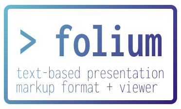

# folium - a portable text-based presentation markup format and viewer

folium is a markup format specifically intended to be used with the eponymous slides viewer.
It is a tool inspired by terminal presentation software such as [patat](https://github.com/jaspervdj/patat)
but born from the requirement of having customisable, beautiful slides rendered in 1080p instead of in plaintext.

You can use `folium` both as a live presentation software (similar in function to something like Microsoft Powerpoint)
or as a static tool from which to export images.
